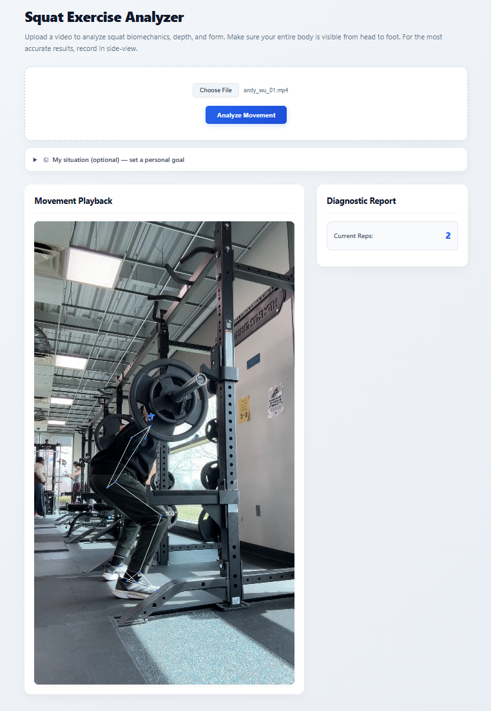
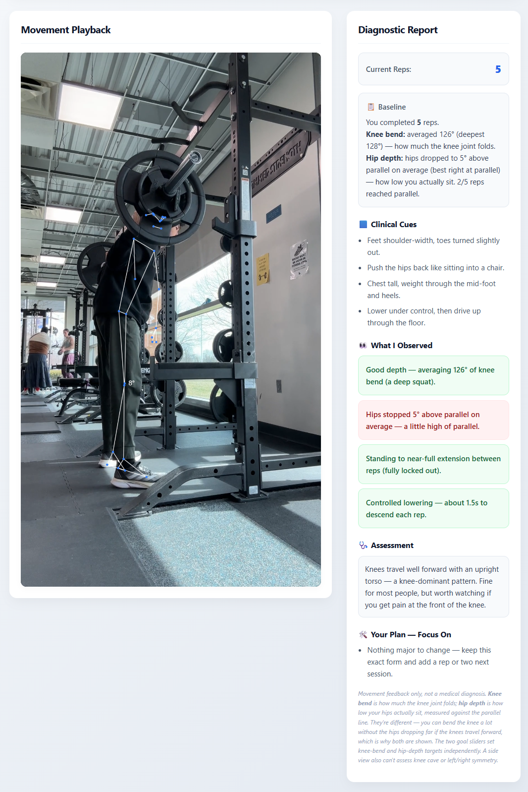

# Rehab Exercise Analyzer

A browser-based physical therapy tool that analyzes a squat from an uploaded video and produces a PT-style diagnostic report — clinical cues, an assessment of what happened, and a short, prioritized correction plan. All processing runs locally in the browser; **video never leaves the device**.

**🔗 [Live Demo](https://andyzwu25.github.io/Rehab-Exercise-Analyzer-v3/)** — upload a squat clip and try it yourself, no install needed.

## Why this exists

Home-exercise adherence is one of the harder problems in rehab, and a big part of it is patients not knowing whether they're doing a movement correctly. This tool watches the movement, measures it honestly, and explains what it saw in plain language — the way a therapist would on a first visit — so a patient leaves with one or two concrete things to work on rather than a pass/fail score.

## Features

- **Local video analysis.** Upload a clip; it's read into a hidden `<video>`, processed frame-by-frame, and drawn to a canvas with a live pose skeleton overlay. Nothing is uploaded over the network.
- **Rep counting** via a full-rep state machine (a rep completes on the return to standing, not on the way down, so the bottom of each rep is captured).
- **A PT-style report** organized as baseline → observations → assessment → plan, generated when the video ends.
- **Two independent depth measurements, reported separately:**
  - *Knee bend (flexion)* — how much the knee joint folds, in clinical ROM convention (0° = straight leg, higher = deeper).
  - *Hip depth* — how low the hips actually sit, measured as the thigh's angle relative to parallel. These genuinely differ: the knees can travel forward and bend a lot without the hips dropping far, and the report names that divergence when it sees it.
- **Additional signals:** trunk-vs-shin lean (used to infer likely ankle-mobility vs hip-dominant patterns), descent tempo, top-of-rep extension, and depth drop-off across the set (fatigue).
- **Personal goals / accommodations.** An optional "My situation" panel lets a patient set a personal knee-bend goal, a personal hip-depth goal, and flag that forward lean is expected for them. These change **how the session is scored, never what's measured** — the real measured numbers always appear in the report, so the diagnostic stays honest and progress stays trackable.
- **Camera-side auto-detection.** Picks the camera-facing body side per frame from MediaPipe visibility scores, with smoothing and hysteresis so the choice doesn't flip mid-rep.

## Screenshots

| Live pose tracking | PT-style report |
|---|---|
|  |  |

## Architecture

100% client-side. No server, no backend, no build step.

| Layer | Tech |
|---|---|
| Pose tracking | MediaPipe Pose (WebAssembly, loaded from CDN) |
| Rendering | HTML5 `<canvas>` — video frames + skeleton overlay |
| Logic | Vanilla JavaScript |
| Styling | Plain CSS |

### File layout

- **`index.html`** — the app shell. Owns the UI, the MediaPipe lifecycle, the video-upload flow, the frame loop, shared geometry helpers (`calculateAngle`, `angleFromVertical`, `mean`), and the camera-side picker. It is exercise-agnostic: it never references "squat" directly.
- **`squat.js`** — the squat exercise module. Owns the per-rep capture, the report generator, the patient-goal profile, and the setup-panel wiring.

The two communicate through a single interface. Each exercise module registers itself as `window.currentExercise`, exposing four methods the shell calls:

```js
window.currentExercise = {
    update,       // (joints, t) => repCount   — called per frame
    reset,        // () => void                — clears per-video state
    finish,       // () => html                — builds the end-of-session report
    readProfile   // () => void                — snapshots the setup panel
};
```

This is the seam that makes new exercises drop-in: a future `lunge.js` or `clamshell.js` implements the same four methods with its own math, and the shell drives it unchanged.

## Usage

Because it loads MediaPipe over the network and reads a local file, serve it over `http://` rather than opening the file directly.

```bash
# from the project folder
python3 -m http.server 8000
# then open http://localhost:8000
```

1. (Optional) Open **⚙️ My situation** to set a personal knee-bend or hip-depth goal.
2. Choose a video and click **Analyze Movement**.
3. Watch the skeleton overlay during playback; the report appears when the clip ends.

**For best results:** film side-on, with the whole body visible from head to feet.

## Known limitations

- **Side view only.** Knee cave (valgus) and left/right asymmetry are frontal-plane findings and can't be assessed from the side; the report says so rather than guessing.
- **Framing sensitivity.** Hip-depth (thigh-to-floor) assumes a reasonably square side view. Filming at a diagonal makes the thigh look flatter than it is, reading slightly deep.
- **Heuristic thresholds.** The cutoffs driving the prose (depth bands, the trunk–shin trigger, fatigue and tempo thresholds, goal tolerances) are reasonable defaults, not clinically validated values. They're meant to be tuned against real footage.
- **Not a medical device.** This is movement feedback, not a diagnosis. A goal set in the app is the patient's own; if it's due to pain or injury it should be confirmed with a physical therapist.

## Roadmap

- **More exercises** — clamshells, lunges, push-ups, pull-ups, each as its own module behind the `currentExercise` interface.
- **Per-exercise setup panels** — let each module inject its own goal controls (a `renderSetup()` method) so the shell no longer hardcodes squat-specific inputs.
- **Session history** — local progress/streak tracking to reinforce adherence.
- **Future (Phase 2):** optional backend for patient profiles, therapist-authored programs, and progress over time — deliberately deferred to keep the current tool zero-backend and free of stored health data.

## License

_Add a license of your choice (e.g. MIT) before publishing._